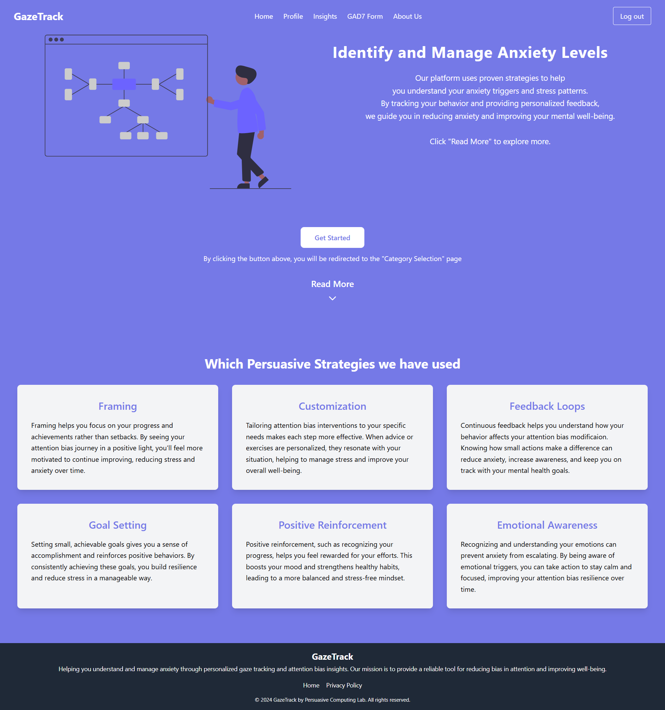

# Gaze Track

## Author

- [Shubham](shubhamjethva92@gmail.com) - _(Maintainer)_

## Prerequisites

- Node.js: Install the latest version of Node.js from [here](https://nodejs.org/)
- Django: Install the latest version of Django from [here](https://www.djangoproject.com/)

## Application Overview

GazeTrack is a cutting-edge web application designed to improve mental health by leveraging real-time gaze tracking and psychological strategies. The platform integrates Attention Bias Modification (ABM) techniques to analyze user behavior, identify anxiety triggers, and provide personalized interventions through visual and textual feedback. GazeTrack ensures a tailored experience by requiring assessments like the GAD-7 form, aligning support with individual needs.

With an intuitive interface and accessible design, GazeTrack empowers users to develop healthier coping mechanisms and monitor their progress over time. By blending technology with compassionate care, the app creates a safe and supportive digital space for individuals to enhance their mental well-being and build resilience against stress and anxiety.

## Key Tasks

- **User Registration and Authentication**: Implement a secure and seamless onboarding process for users, ensuring the protection of personal data. The system will support both sign-up and sign-in functionality, along with password recovery options.
- **Category Selection**: Allow users to select the category to see the images based on their selection and allow them to personalize their experience.
- **Gaze Calibration**: Integrate a gaze calibration feature that enables users to align their gaze for accurate tracking. This step ensures precision in detecting visual attention patterns during subsequent tests.
- **Gaze Test with ML Model**: Train and implement a machine learning model using collected data, employing train and test datasets to refine accuracy. The model will classify user attention patterns and offer detailed feedback to support mental health improvement.
- **Result Page with LLM Integration**: Display personalized results on a dedicated page, enhanced by integration with a Large Language Model (LLM) to provide actionable insights and recommendations.
- **GAD-7 Form**: Incorporate a mandatory GAD-7 anxiety assessment form to evaluate users' anxiety levels. The system ensures that users complete the form before proceeding to other features, providing a foundational understanding of their mental health status.

## Technologies Used

- **React JS:** React was selected for the frontend to deliver a dynamic and interactive user experience. Its component-based architecture ensures smooth rendering of features like the gaze calibration interface, gaze tests, and real-time feedback mechanisms. React’s ability to manage state efficiently supports the seamless integration of ML predictions and user-specific data visualization, enhancing user engagement.
- **Django:** Django serves as the robust backend framework for GazeTrack, providing a secure and scalable environment for managing core application functionalities. Its built-in tools streamline user authentication, form handling, and database operations. Django's compatibility with machine learning workflows is leveraged to integrate a Logistic Regression ML model for result prediction. This model analyzes gaze data gaze tests, to classify user attention patterns and predict personalized outcomes, ensuring accurate and actionable insights for mental health improvement.
- **AWS PostgreSQL:** AWS-hosted PostgreSQL is the database of choice for GazeTrack, offering high performance, scalability, and strong security for managing sensitive user data. It is used to store user profiles, form submissions, gaze test results, and predictions generated by the Logistic Regression ML model. Hosting on AWS ensures data availability, compliance with best practices in cloud security, and seamless integration with the application’s backend.

## Work Done in Developing the Proposed Application Prototype

### 1. **Frontend Development:**

- **Session Management**  
  Implemented robust session management using **React** and **JWT** to ensure secure and seamless user sessions. This includes token-based authentication for enhanced user security and data protection.

- **Security**  
  Integrated secure mechanisms to safeguard user data and prevent unauthorized access. Used **HTTPS**, **token validation**, and best practices to ensure a secure user experience.

- **Profile Management**  
  Developed user-friendly components for managing profiles, including updating personal information, uploading profile pictures, and managing preferences efficiently.

- **Gaze Calibration**  
  Created an interactive gaze calibration feature to align the user's gaze accurately, ensuring precise tracking during gaze tests.

- **Gaze Test**  
  Implemented an intuitive gaze test interface that collects x and y coordinate data, enabling real-time user attention analysis.

- **Data Visualization with Charts**  
  Enhanced result interpretation by integrating **charts and graphs** for visualizing gaze test outcomes, providing users with clear insights into their attention patterns.

- **Result Page**  
  Designed a dedicated result page to display personalized feedback and recommendations, incorporating visually appealing elements for better user engagement.

### 2. **Backend Development:**

- **GAD-7 Form Integration**  
  Incorporated the GAD-7 anxiety assessment form to evaluate user anxiety levels and tailor subsequent interventions.

- **Gaze Calibration and Tracking**  
  Developed gaze calibration functionality and gaze tests to collect x and y coordinate data for real-time attention analysis.

- **Machine Learning Integration**  
  Implemented a **Logistic Regression ML model** for predicting results based on gaze data, using train and test datasets to improve accuracy.

- **Result Page with LLM Integration**  
  Displayed personalized results with actionable insights and recommendations using a **Large Language Model (LLM)**.

- **Secure Data Management**  
  Utilized **AWS PostgreSQL** for reliable, scalable, and secure storage of user data, including profiles, form submissions, and ML predictions.

### 3. **Deployment:**

- **Netlify**  
  The frontend of GazeTrack is deployed on **Netlify**, providing a fast, secure, and reliable platform for hosting static websites and single-page applications. With automatic builds and continuous deployment from the Git repository, Netlify ensures a seamless and efficient deployment process.

- **Render**  
  The backend, built using Django, is hosted on **Render**, offering a scalable and flexible environment for managing server-side logic. Render simplifies deployment with built-in support for web services and ensures high availability for API endpoints.

- **AWS PostgreSQL**  
  The application's database is hosted on **AWS PostgreSQL**, ensuring secure and scalable storage of user data. AWS provides automated backups, high availability, and robust security features, making it the ideal choice for handling sensitive user information.

## Installation Instructions

### Prerequisites

- **Node.js** (v14 or higher)
- **Python** (v3.8 or higher)
- **PostgreSQL** database
- **Git**

### Frontend

1. **Navigate to the Frontend Directory**  
   Move into the `frontend` directory:
   ```bash
   cd frontendGazeTrack
   ```
2. Install the required dependencies:
   ```sh
   npm install
   ```
3. Start the development server:
   ```sh
   npm start
   ```

### Backend

1. 1. **Navigate to the Backend Directory**  
      Move into the `backend` directory:
   ```bash
   cd backendGazeTrack
   ```
2. Set Up Python Environment:
   ```sh
   python -m venv venv
   ```
   ```sh
   cd env/bin/activate
   ```
3. Install Dependencies:
   ```sh
   pip install pipenv
   ```
   ```sh
   pipenv install
   ```
4. Run Database Migrations:
   ```sh
   python manage.py makemigrations
   ```
   ```sh
   python manage.py migrate
   ```
5. Start the Backend Server:
   ```sh
   python manage.py runserver
   ```

### Set up the environment variables in env files from .env.example file from the directories.

### Make sure to rename .env.example to .env while setting up the project.

---

### Some visuals of the website.

## home page:


